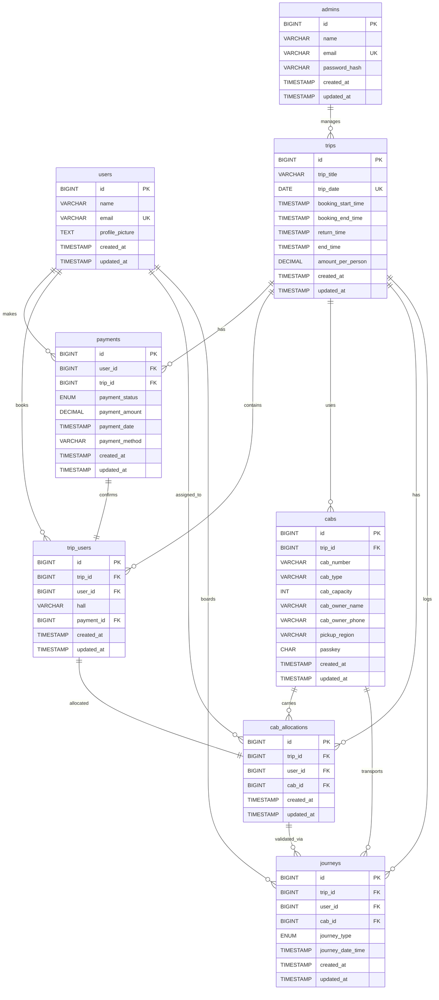

# Entity Relationship Diagram

## Friday Cab Allocation System

---

## Visual ER Diagram (Mermaid Format)



---

## Relationship Cardinality

### One-to-Many Relationships

| Parent Table | Child Table      | Relationship | Description |
|--------------|------------------|--------------|-------------|
| `users`      | `payments`       | 1:N          | One user can make multiple payments |
| `users`      | `trip_users`     | 1:N          | One user can book multiple trips |
| `users`      | `cab_allocations`| 1:N          | One user can have multiple allocations |
| `users`      | `journeys`       | 1:N          | One user can have multiple journey logs |
| `trips`      | `payments`       | 1:N          | One trip can have multiple payments |
| `trips`      | `trip_users`     | 1:N          | One trip can have multiple bookings |
| `trips`      | `cabs`           | 1:N          | One trip can have multiple cabs |
| `trips`      | `cab_allocations`| 1:N          | One trip can have multiple allocations |
| `trips`      | `journeys`       | 1:N          | One trip can have multiple journey logs |
| `cabs`       | `cab_allocations`| 1:N          | One cab can carry multiple students |
| `cabs`       | `journeys`       | 1:N          | One cab can have multiple journey logs |

### One-to-One Relationships

| Table 1       | Table 2          | Relationship | Description |
|---------------|------------------|--------------|-------------|
| `payments`    | `trip_users`     | 1:1          | Each confirmed payment creates one booking |
| `trip_users`  | `cab_allocations`| 1:1          | Each booking gets one cab allocation |

---

## Detailed Relationship Descriptions

### 1. User → Payments
- **Type:** One-to-Many
- **Foreign Key:** `payments.user_id` → `users.id`
- **Description:** A student can make multiple payment attempts across different trips

### 2. User → Trip_Users
- **Type:** One-to-Many
- **Foreign Key:** `trip_users.user_id` → `users.id`
- **Description:** A student can have confirmed bookings for multiple trips (different Fridays)

### 3. User → Cab_Allocations
- **Type:** One-to-Many
- **Foreign Key:** `cab_allocations.user_id` → `users.id`
- **Description:** A student can be allocated to different cabs across multiple trips

### 4. User → Journeys
- **Type:** One-to-Many
- **Foreign Key:** `journeys.user_id` → `users.id`
- **Description:** A student can have multiple journey logs (pickup, dropoff, multiple trips)

### 5. Trip → Payments
- **Type:** One-to-Many
- **Foreign Key:** `payments.trip_id` → `trips.id`
- **Description:** Each trip can have payments from multiple students

### 6. Trip → Trip_Users
- **Type:** One-to-Many
- **Foreign Key:** `trip_users.trip_id` → `trips.id`
- **Description:** Each trip has multiple confirmed bookings

### 7. Trip → Cabs
- **Type:** One-to-Many
- **Foreign Key:** `cabs.trip_id` → `trips.id`
- **Description:** Each trip uses multiple cabs for transportation

### 8. Trip → Cab_Allocations
- **Type:** One-to-Many
- **Foreign Key:** `cab_allocations.trip_id` → `trips.id`
- **Description:** Each trip has multiple student-to-cab allocations

### 9. Trip → Journeys
- **Type:** One-to-Many
- **Foreign Key:** `journeys.trip_id` → `trips.id`
- **Description:** Each trip logs multiple journey validations

### 10. Payment → Trip_Users
- **Type:** One-to-One
- **Foreign Key:** `trip_users.payment_id` → `payments.id`
- **Description:** Each confirmed booking references exactly one successful payment

### 11. Trip_Users → Cab_Allocations
- **Type:** One-to-One (Logical)
- **Foreign Keys:** Both reference same `trip_id` and `user_id`
- **Description:** Each confirmed booking receives exactly one cab allocation

### 12. Cab → Cab_Allocations
- **Type:** One-to-Many
- **Foreign Key:** `cab_allocations.cab_id` → `cabs.id`
- **Description:** Each cab carries multiple students (up to capacity)

### 13. Cab → Journeys
- **Type:** One-to-Many
- **Foreign Key:** `journeys.cab_id` → `cabs.id`
- **Description:** Each cab logs multiple boarding validations

### 14. Cab_Allocations → Journeys
- **Type:** One-to-Many (Logical)
- **Foreign Keys:** Both reference same `trip_id`, `user_id`, `cab_id`
- **Description:** Each allocation can generate multiple journey logs (outbound + return)

---

## Entity Categories

### Core Entities (Independent)
- **users**: Student master data
- **admins**: Admin master data
- **trips**: Trip master data

### Transaction Entities (Dependent)
- **payments**: Financial transactions
- **trip_users**: Booking records
- **cabs**: Vehicle inventory per trip

### Mapping Entities (Junction/Assignment)
- **cab_allocations**: Student-to-Cab mapping

### Audit/Log Entities
- **journeys**: Validation event logs

---

## Cascade Delete Behavior

All foreign keys use `ON DELETE CASCADE` to maintain referential integrity:

```sql
-- Example: If a trip is deleted, all related data is automatically removed
DELETE FROM trips WHERE id = 1;

-- This will CASCADE delete from:
-- ├── payments (for trip_id = 1)
-- ├── trip_users (for trip_id = 1)
-- ├── cabs (for trip_id = 1)
-- ├── cab_allocations (for trip_id = 1)
-- └── journeys (for trip_id = 1)
```

**Exception:** `trip_users.payment_id` uses `ON DELETE SET NULL` to preserve booking history even if payment record is removed.

---

## Normalized Form Analysis

### Third Normal Form (3NF) Compliance

✅ **1NF:** All attributes are atomic (no multi-valued fields)  
✅ **2NF:** No partial dependencies (all non-key attributes depend on entire primary key)  
✅ **3NF:** No transitive dependencies (no non-key attribute depends on another non-key attribute)

### Example: Why separate `payments` from `trip_users`?

**Without separation (violation):**
```
trip_users: [id, trip_id, user_id, hall, payment_amount, payment_status, payment_date]
```
Problem: `payment_status` depends on `payment_date` (transitive dependency)

**With separation (3NF compliant):**
```
payments: [id, user_id, trip_id, payment_amount, payment_status, payment_date]
trip_users: [id, trip_id, user_id, hall, payment_id]
```
Benefit: Payment can exist independently, supports refunds, multiple attempts, etc.

---

## Data Integrity Constraints

### Unique Constraints Summary

```sql
-- Prevent duplicate user emails
ALTER TABLE users ADD CONSTRAINT uk_users_email UNIQUE (email);

-- Prevent duplicate admin emails
ALTER TABLE admins ADD CONSTRAINT uk_admins_email UNIQUE (email);

-- One trip per Friday
ALTER TABLE trips ADD CONSTRAINT uk_trips_date UNIQUE (trip_date);

-- One booking per student per trip
ALTER TABLE trip_users ADD CONSTRAINT uk_trip_users_booking 
    UNIQUE (trip_id, user_id);

-- No duplicate cabs in same trip
ALTER TABLE cabs ADD CONSTRAINT uk_cabs_trip_number 
    UNIQUE (trip_id, cab_number);

-- One cab allocation per student per trip
ALTER TABLE cab_allocations ADD CONSTRAINT uk_cab_allocations_user 
    UNIQUE (trip_id, user_id);
```

### Check Constraints

```sql
-- Payment amount must be positive
ALTER TABLE payments ADD CONSTRAINT ck_payment_amount 
    CHECK (payment_amount > 0);

-- Cab capacity must be positive
ALTER TABLE cabs ADD CONSTRAINT ck_cab_capacity 
    CHECK (cab_capacity > 0);

-- Booking end must be after start
ALTER TABLE trips ADD CONSTRAINT ck_trips_booking_window 
    CHECK (booking_end_time > booking_start_time);

-- Passkey must be 4 digits
ALTER TABLE cabs ADD CONSTRAINT ck_passkey_format 
    CHECK (passkey REGEXP '^[0-9]{4}$');
```

---

## Indexing Strategy for Performance

### Primary Indexes (Automatic)
All `id` columns have B-tree indexes as primary keys.

### Foreign Key Indexes (Critical)
```sql
CREATE INDEX idx_payments_user ON payments(user_id);
CREATE INDEX idx_payments_trip ON payments(trip_id);
CREATE INDEX idx_trip_users_trip ON trip_users(trip_id);
CREATE INDEX idx_trip_users_user ON trip_users(user_id);
CREATE INDEX idx_cabs_trip ON cabs(trip_id);
CREATE INDEX idx_cab_allocations_user ON cab_allocations(user_id);
CREATE INDEX idx_cab_allocations_cab ON cab_allocations(cab_id);
CREATE INDEX idx_journeys_trip ON journeys(trip_id);
CREATE INDEX idx_journeys_user ON journeys(user_id);
CREATE INDEX idx_journeys_cab ON journeys(cab_id);
```

### Composite Indexes (Query Optimization)
```sql
-- Admin demand dashboard query
CREATE INDEX idx_trip_users_demand ON trip_users(trip_id, hall);

-- Driver validation query
CREATE INDEX idx_cab_allocations_validation ON cab_allocations(trip_id, user_id, cab_id);

-- Journey analytics
CREATE INDEX idx_journeys_analytics ON journeys(trip_id, journey_type, journey_date_time);

-- Active trip lookup
CREATE INDEX idx_trips_active ON trips(booking_start_time, booking_end_time);
```

---

## Query Patterns by Use Case

### 1. Student Registration Flow
```sql
-- Check if user exists
SELECT id FROM users WHERE email = 'student@example.com';

-- Create payment
INSERT INTO payments (user_id, trip_id, payment_status, payment_amount) 
VALUES (1, 1, 'pending', 50.00);

-- Confirm booking after payment
INSERT INTO trip_users (trip_id, user_id, hall, payment_id) 
VALUES (1, 1, 'LBS', 5);
```

### 2. Admin Demand Dashboard
```sql
-- Get hall-wise demand
SELECT hall, COUNT(*) as student_count
FROM trip_users
WHERE trip_id = 1
GROUP BY hall
ORDER BY student_count DESC;
```

### 3. Cab Allocation Process
```sql
-- Create cabs
INSERT INTO cabs (trip_id, cab_number, cab_capacity, pickup_region, passkey)
VALUES (1, 'WB-06-1234', 7, 'LBS', '4590');

-- Allocate students to cabs (after optimization)
INSERT INTO cab_allocations (trip_id, user_id, cab_id)
VALUES (1, 1, 5), (1, 2, 5), (1, 3, 5); -- Up to 7 students per cab
```

### 4. QR Validation (Outbound)
```sql
-- Get student's assigned cab
SELECT ca.cab_id, c.pickup_region
FROM cab_allocations ca
JOIN cabs c ON ca.cab_id = c.id
WHERE ca.trip_id = 1 AND ca.user_id = 1;

-- Verify driver's passkey
SELECT id, cab_number FROM cabs
WHERE trip_id = 1 AND passkey = '4590';

-- Log successful boarding
INSERT INTO journeys (trip_id, user_id, cab_id, journey_type)
VALUES (1, 1, 5, 'pickup');
```

### 5. Journey Analytics
```sql
-- Students who boarded
SELECT u.name, u.email, c.cab_number, j.journey_type, j.journey_date_time
FROM journeys j
JOIN users u ON j.user_id = u.id
JOIN cabs c ON j.cab_id = c.id
WHERE j.trip_id = 1
ORDER BY j.journey_date_time;

-- No-shows (paid but didn't board)
SELECT u.name, u.email, tu.hall
FROM trip_users tu
JOIN users u ON tu.user_id = u.id
LEFT JOIN journeys j ON tu.user_id = j.user_id AND tu.trip_id = j.trip_id
WHERE tu.trip_id = 1 AND j.id IS NULL;
```

---

## Visual Reference: Table Connections

```
┌─────────┐         ┌──────────┐
│  users  │────────▶│ payments │
└────┬────┘         └────┬─────┘
     │                   │
     │              ┌────▼──────┐
     ├─────────────▶│trip_users │
     │              └────┬──────┘
     │                   │
     │              ┌────▼────────────┐
     ├─────────────▶│cab_allocations  │◀────┐
     │              └────┬────────────┘     │
     │                   │                  │
     │              ┌────▼────┐        ┌────┴────┐
     └─────────────▶│journeys │◀───────│  cabs   │
                    └────┬────┘        └────┬────┘
                         │                  │
                    ┌────▼──────────────────▼────┐
                    │         trips               │
                    └─────────────────────────────┘

┌─────────┐
│ admins  │ (manages system, no direct FK)
└─────────┘
```

---

**Document End**

To view this diagram:
1. Copy the Mermaid code block
2. Paste into: https://mermaid.live/
3. Or use Mermaid plugins in VS Code, Notion, GitHub, etc.


